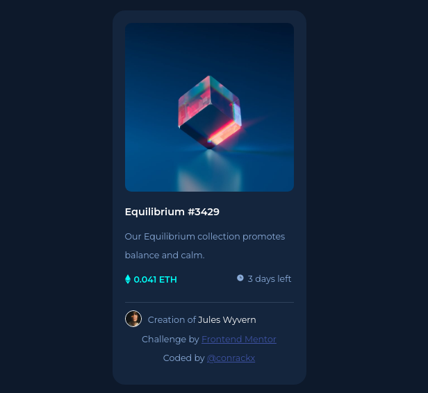

# Frontend Mentor - NFT preview card component solution

This is a solution to the [NFT preview card component challenge on Frontend Mentor](https://www.frontendmentor.io/challenges/nft-preview-card-component-SbdUL_w0U). Frontend Mentor challenges help you improve your coding skills by building realistic projects. 

## Table of contents

- [Overview](#overview)
  - [The challenge](#the-challenge)
  - [Screenshot](#screenshot)
  - [Links](#links)
- [My process](#my-process)
  - [Built with](#built-with)
  - [What I learned](#what-i-learned)
  - [Continued development](#continued-development)
  - [Useful resources](#useful-resources)
- [Author](#author)
- [Acknowledgments](#acknowledgments)

**Note: Delete this note and update the table of contents based on what sections you keep.**

## Overview

### The challenge

Users should be able to:

- View the optimal layout depending on their device's screen size
- See hover states for interactive elements

### Screenshot




## My process

### Built with

- Semantic HTML5 markup
- CSS custom properties
- BEM
- Flexbox
- CSS Grid
- Mobile-first workflow


### What I learned

Not only the making process but how to optimize some aspects of the ode, for example single-line css classes for easier usage like

```css
html {font-size: 62.5%;}
```
the usage of transparency
```css
.overlay {
  ...
  background: hsla(178, 100%, 50%, 0.5);
  ...
}
```
as well as icons in css
```css
.card-content .card-price .price i {
  content: url(./images/icon-ethereum.svg);
  ...
}
```

### Continued development

i still have a lot lo learn and would like to correct some of the unresolved issues this have like the position of the icons. 

## Author

- Frontend Mentor - [@conrackx](https://www.frontendmentor.io/profile/conrackx)
- Twitter - [@conrackx](https://www.twitter.com/conrackx)

## Acknowledgments

Thanks to everyone who helped me make this and every other project, a little bit better.